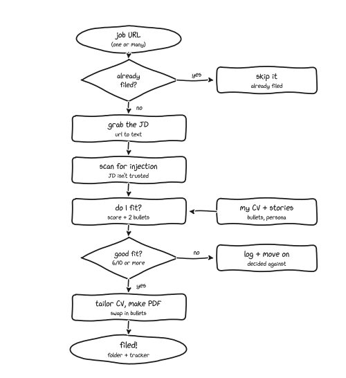

# Applywright

<p align="center">
  
</p>

An agentic job-application pipeline you run from your own machine. You paste a job URL (or a queue of them); the agent fetches the posting, scans it for prompt-injection, assesses fit against your CV and portfolio, tailors your resume, exports a clean PDF, and records the application in a tracker. You review and submit.

Built for **Claude Code**. The work runs locally. Your CV, bullets, and applications never leave your machine.

## What it does

- **Fetches** the JD from a URL, with fallbacks (direct fetch, Jina reader, ATS-iframe detection, manual paste).
- **Scans for prompt-injection** in two layers: a mechanical script (invisible characters, known phrases, HTML-comment imperatives, AI-directed commands) and a semantic pass where the agent reads the JD for manipulation disguised as job requirements. Job postings are untrusted input; this treats them that way.
- **Assesses fit** against your CV, persona, and a library of tagged "master bullets," producing a scored verdict and picking the two bullets that best match the role.
- **Tailors and exports** your resume to PDF (Typst), swapping in the chosen bullets and a per-application UTM tag on your portfolio link.
- **Tracks** every application in a CSV (default, zero setup) or Notion (optional), and **dedups** so the same job is never filed twice.
- **Drafts cover letters and application-form answers** in your voice, on request, with a strict anti-AI-tell rule set.

<p align="center">
  
</p>

## Your data lives in one place: `profile/`

Everything personal (identity, CV, bullets, persona, learnings) lives in `profile/`, which is **gitignored**. The engine (skills, scripts, templates) carries none of your details; it reads them from `profile/config.yaml` at runtime. That means you can publish or fork the engine freely, and your information stays put.

The repo ships `profile.example/` (a complete demo persona). Your real `profile/` is created from it on setup.

## Quick start

**New machine (macOS, Linux, or Windows):**

First install the toolchain: Claude Code, Python 3, pandoc, typst, and pipx.
- macOS: `brew install pandoc typst pipx` (and install Claude Code + Python).
- Windows (PowerShell): `winget install JohnMacFarlane.Pandoc` and `winget install Typst.Typst`, then install pipx with `py -m pip install --user pipx` (and install Claude Code + Python). Native Claude Code, no WSL.

Then clone, install the CLI, and bootstrap:

```bash
git clone <your-fork-url> applywright
cd applywright
pipx install .          # installs the `applywright` command onto your PATH
applywright bootstrap   # profile/ from the example, tracker init, output/ inbox/ temp/
```

If `applywright` is reported as not found after install, run `pipx ensurepath`,
open a new terminal, and retry. That command must be on your PATH for the agent
to use it; `pipx ensurepath` adds pipx's bin directory (`~/.local/bin`) to your
shell profile. Verify the whole toolchain with `applywright doctor`. Per-OS
details are in `SETUP-WITH-AI.md`.

On Windows this is the step most likely to need attention. If PowerShell reports
that `applywright` is not recognized after `pipx install .`, run `pipx ensurepath`,
close the terminal, and open a new one so the session picks up the updated PATH.
Then run `applywright doctor` from inside the repo folder to confirm the command
resolves and the toolchain is complete.

The fastest way to fill `profile/` is the guided setup: run `claude` and say **"set me up."** The orientation skill walks you through config, CV, bullets, and persona, and saves progress so you can stop and resume. Or edit the files by hand:

1. `profile/config.yaml`: name, email, phone, portfolio URL, tracker mode
2. `profile/cv.md`: your resume, with `{bullet_2}` / `{bullet_3}` placeholders the agent fills
3. `profile/master-bullets.md`: your tagged story bank
4. `profile/persona.md`: your positioning and case studies (or run `refresh-persona` if you have a site)

**Existing machine:**

```bash
cd applywright
claude              # opens Claude Code here; it reads CLAUDE.md automatically
```

Paste a job URL, or queue many in `inbox/jobs.txt` and say "process my inbox."

## Daily use

**Single job (auto by default):**
Paste a URL. The agent fetches, scans, assesses fit, then decides:
- Strong/Exceptional (≥6/10) → tailors the CV, exports the PDF, records the application as `To apply`.
- Weak/No fit (≤5/10) → records it as `Decided against applying`.
- No cover letter in auto mode. You review the folder and submit.

**Want to weigh in?** Say "manual" (or "pause" / "let me decide") with the URL. The agent then stops at the fit assessment so you can override the bullet picks or ask for a cover letter.

**Bulk (always auto):**
Drop URLs into `inbox/jobs.txt` (one per line), say "process my inbox," and the agent works top to bottom. You can keep appending URLs mid-run. Already-filed URLs are skipped (dedup); fetch failures are marked ❌ for manual retry. A roll-up prints at the end.

**Post-processing (on request): cover letters and form answers.**
These never run automatically. Ask for them by company name or short-id once a job is filed.
- *Cover letter:* say "cover letter for {company}" (or the short-id). The agent drafts in your voice using `profile/cover-letter-field-notes.md` and the rules in `skills/shared/writing-rules.md`, exports a PDF, and saves both the draft and the PDF into the application folder. The greeting and sign-off are fixed strings the template depends on, so it leaves those alone.
- *Application-form answers:* paste the question(s) from the form (for example "Why this company?" or a "describe a time when..." prompt). The agent answers from your persona and master bullets, in your voice, and saves them to the application folder so you can paste them back into the form.

**What you'll see: files open for review.**
After a step finishes, the agent opens the file it just produced so you can read it: the fit report, the cover-letter draft, the final PDF. Drafts are Markdown (`.md`). On macOS a `.md` file opens in whatever app is registered for it, which is plain TextEdit by default. Install a Markdown-aware editor so these render properly. [VS Code](https://code.visualstudio.com/) is the common pick; set it as the default app for `.md` files. Final resumes and cover letters are PDFs and open in Preview.

## Approval prompts: why it pauses

The engine runs multi-step Bash. Claude Code gates certain command shapes behind a yes/no prompt before they run. This is Claude Code's safety layer working as intended. The run has not failed; the agent is waiting for you. It will look like it stops mid-flow, sits on a prompt, then continues once you answer.

You'll see these most often:
- **`cd` plus output redirection** in one compound command, flagged as "path resolution bypass."
- **Brace groups containing quotes**, flagged as "expansion obfuscation." The JD-saving step writes frontmatter this way.
- **First touch of a directory** (for example creating an `output/{company}` folder), which asks once per directory.
- **A command's first run** (`applywright fetch`, `applywright export-pdf`, and similar). Everything runs as `applywright ...`.

All of these are expected and safe to approve. At each prompt:
- Pick **Yes** to run that one command.
- Pick **"Yes, and always allow..."** or **"don't ask again for: applywright *"** to stop being asked for that pattern again.

Runs get quieter as you approve the patterns you trust. A bulk run of many jobs prompts a few times at the start, then settles into almost none.

If you'd rather skip the prompts from the very first run, this repo ships a small pre-approval for you. `.claude/settings.json` holds a single rule:

```json
{ "permissions": { "allow": ["Bash(applywright:*)"] } }
```

That tells Claude Code to run the project's own `applywright ...` commands without asking each time. It is scoped to that one command, not to all shell access (it is deliberately not `Bash(*)`), so it covers this pipeline's CLI and nothing else. If you'd rather approve each call yourself, delete the file or remove that line and the prompts come back. Any personal allow rules you add for your own machine belong in `.claude/settings.local.json`, which Claude Code keeps out of version control, so they stay local and never ship with the repo.

## Tracking: CSV (default) or Notion (optional)

Set `tracker.mode` in `profile/config.yaml`.

- **csv**: rows go to `output/applications.csv` via `applywright tracker`. No setup. Columns: `filed_at, short_id, company, role, url, source, stage, fit, comments, submission_date`. Move applications through stages by editing the `stage` column.
- **notion**: rows go to a Notion database via the Notion MCP. Requires the MCP configured in Claude Code and two database IDs in `profile/config.yaml` under `tracker.notion`.

Either way, the agent checks the tracker before filing and won't record a duplicate URL.

## When scraping fails

Single job: paste the JD into `inbox/jd.md` (the [MarkDownload](https://github.com/deathau/markdownload) browser extension preserves formatting well) and tell the agent. In bulk/auto runs there's no paste prompt; failed fetches are marked ❌ in `jobs.txt` for manual retry.

## Layout

```
applywright/
├── CLAUDE.md            # master instructions Claude reads every session
├── profile/             # YOUR data (gitignored): config, cv, bullets, persona, field notes
├── profile.example/     # demo persona; profile/ is created from it
├── output/              # filed applications + applications.csv (gitignored)
├── inbox/               # jobs.txt (bulk queue) + jd.md (paste fallback)
├── skills/              # workflow playbooks the agent loads as needed
├── src/applywright/     # the applywright CLI (installed via pipx install .)
├── pyproject.toml       # package metadata for the applywright command
├── templates/           # Typst templates (CV, cover letter, document)
└── temp/                # scratch (gitignored)
```

## Editing the pipeline

Behavior lives in `CLAUDE.md` and `skills/*/SKILL.md`. Edit those to change how it works; most tweaks need no code. The voice rules for written application materials are in `skills/shared/writing-rules.md`; tune them to your taste.

## Privacy

`profile/`, `output/`, `temp/` contents, `.env`, and the paste buffer are gitignored. Your CV, bullets, and applications are never tracked by git unless you change that.

## Using Claude in the browser (no install)

You can run a lighter version of this without installing Claude Code by handing the repo and your profile to Claude in the browser (claude.ai). Useful for trying it before you install anything, or working from a machine that doesn't have Claude Code.

Setup, per chat:
1. Upload your `profile/` files (`config.yaml`, `cv.md`, `master-bullets.md`, `persona.md`, and the field notes), or paste their contents.
2. Give Claude the engine: upload a zip of the repo, or point Claude at this public repo so it can read `CLAUDE.md` and `skills/`.
3. Paste a job URL or the JD text.

The idea is the same (fetch, scan, assess fit, tailor, draft a cover letter or answers), with these differences from the Claude Code version:
- **Nothing auto-opens.** The browser can't open files on your machine. Claude returns the fit report, the tailored resume, and any cover letter inline, and you copy or download them.
- **No `open` step, no local tracker writes.** You update your CSV yourself. If you connect the Notion connector in the browser, Claude can record applications there.
- **PDF export runs in Claude's sandbox or on your machine.** Claude can run the Typst export in its own sandbox and hand you a finished PDF to download, or return the tailored `cv.md` for you to export locally with `applywright export-pdf`.
- **No approval prompts.** The browser sandbox runs without Claude Code's per-command yes/no gates, so the run doesn't pause the same way.
- **More manual.** Files move in and out by upload and download instead of living in one local folder. There's no bulk queue and no dedup against a local tracker.

Use this when you can't install Claude Code. For day-to-day volume, the Claude Code flow above stays faster.

## A note on other agents

Applywright is Claude-Code-native: it relies on Claude Code's skill discovery, the `open` command (macOS), and a set of scripts that exist to keep file mutations off the shell. The *materials* (your `profile/`, the CSV, the templates) are agent-agnostic, so a port to another agent would reuse them and swap the engine. That port isn't here yet.

## License

MIT. See [LICENSE](LICENSE).